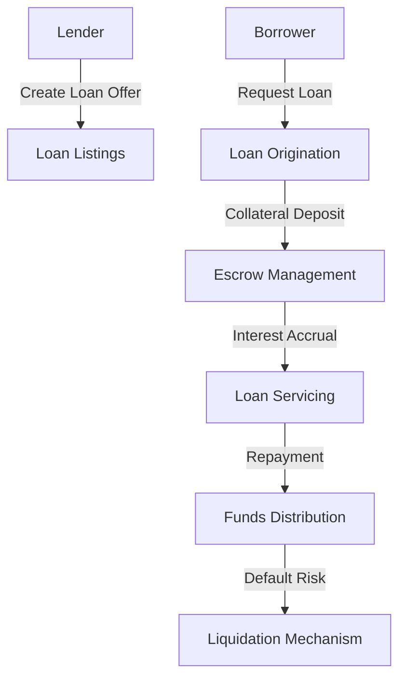

# SanitizeLending - Decentralized Lending Protocol

A secure, transparent lending platform built on Stacks blockchain that connects lenders and borrowers through smart contracts.

## Overview

SanitizeLending enables decentralized lending with advanced risk management features:

- Collateralized loan mechanisms
- Dynamic interest rate calculations
- Credit scoring and reputation system
- Automated liquidation protection
- Transparent lending metrics

## Architecture

The lending platform is built around a central smart contract that manages loans, collateral, and user reputations.



### Core Components

1. **Loan Management**: Tracks loan terms, status, and conditions
2. **Collateral Handling**: Manages asset-backed lending
3. **Risk Assessment**: Calculates credit scores and risk profiles
4. **Liquidation Protection**: Automated mechanisms to protect lenders

## Contract Documentation

### Main Contract: lending-core.clar

The primary contract handling lending platform functionality.

#### Key Features:

- Loan creation and management
- Collateral deposit and tracking
- Interest calculation
- Credit scoring
- Liquidation mechanisms
- Reputation tracking

#### Access Control

- Lenders can create and manage loan offers
- Borrowers can request and repay loans
- Liquidation processes follow predefined rules
- Reputation system based on lending history

## Getting Started

### Prerequisites

- Clarinet
- Stacks wallet
- STX tokens for transactions

### Basic Usage

#### Creating a Loan Offer

```clarity
(contract-call? .lending-core create-loan-offer 
    u10000 ;; Loan amount in microSTX
    u500 ;; Interest rate (basis points)
    u86400 ;; Loan duration (blocks)
    u15000 ;; Minimum collateral amount
)
```

#### Requesting a Loan

```clarity
(contract-call? .lending-core request-loan 
    u1 ;; loan-offer-id
    u5000 ;; Collateral amount
    "BTC" ;; Collateral type
)
```

## Function Reference

### Loan Management

```clarity
(create-loan-offer (amount uint) (interest-rate uint) (duration uint) (min-collateral uint))
(request-loan (loan-offer-id uint) (collateral-amount uint) (collateral-type (string-ascii 10)))
```

### Loan Operations

```clarity
(deposit-collateral (loan-id uint) (amount uint))
(repay-loan (loan-id uint) (amount uint))
(liquidate-loan (loan-id uint))
```

### Reputation System

```clarity
(get-credit-score (user principal))
(update-credit-score (user principal) (loan-performance uint))
```

## Development

### Testing

1. Clone the repository
2. Install Clarinet
3. Run tests:
```bash
clarinet test
```

### Local Development

1. Start Clarinet console:
```bash
clarinet console
```

2. Deploy contracts:
```bash
clarinet deploy
```

## Security Considerations

### Limitations

- Collateral value fluctuations
- Potential oracle manipulation risks
- Smart contract upgrade challenges

### Best Practices

1. Diversify loan portfolio
2. Maintain adequate collateralization
3. Implement robust liquidation mechanisms
4. Use reliable price oracles
5. Continuously monitor smart contract performance